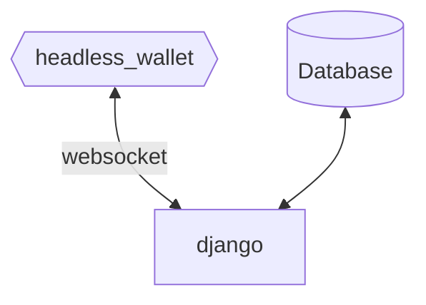

# AES - Automatic Exchange Service
<!-- We are proud to announce our first open-source project for Hathor ecosystem!  -->
<!-- ## What is it!? -->
<!-- Planned to be used as an ICO platform for projects which are willing to sell their tokens with an automatic solution. -->

Simple token exchange machine to run on top of Hathor Network. It was build for the proof of concept of Dozer Protocol before we got into nano contracts testing, and we made it open source now.
It can be used for an ICO platform  or for existing projects to provide liquidity for its investors before nanocontracs and Dozer Swap goes live.

The design is as follow



Using the notification plugin bundled on headless wallet, a websocket connection between the wallet and the django backend will be responsible for trigger the TX subsequent treatment.

## Pre-requisites

- Docker
- Hathor Wallet
- $TokenX and $HTR

The only thing you will need before deploy the service is a hathor wallet with an amount of the token will be on sale. Besides that, it's interesting to send all the token amount to only one address, which will be used on RECEIVE_ADDRESS parameter.

## How to use

```
git clone https://github.com/Dozer-Protocol/automatic-exchange-service
```
Set the following parameters of the `docker-compose.template.yml`:

```
backend:
    - WALLET_PASS_TEST=<passphrase_for_test_wallet>
      - WALLET_PASS=<passphrase_for_main_wallet>
      - WALLET_ID=<id_for_wallet>
      - TOKEN_PRICE=<token_price_in_htr>
      - TOKEN_BUYBACK_PRICE=<token_price_for_buyback_action_in_htr>
      - TOKEN_UUID=<uuid_of_selling_token>
      - RECEIVE_ADDRESS=<address_to_scan_for_received_tokens>
 wallet:
      - HEADLESS_SEED_DEFAULT: enter your seeds separeted with spaces and without quotes
```

Those are local enviroment varibles that needs to be set on the local docker container.

If you want to run at mainnet, comment the wallet service and uncomment the below wallet service, designed for mainnet, remember to change your seeds, if needed.

Stop any Hathor headless wallet running on the Host.

Rename `docker-compose.template.yml` to `docker-compose.yml` and execute `docker compose build` and `docker compose up` on the root of the repository.

```
mv docker-compose.template.yml docker-compose.yml
docker compose build
docker compose up
```
## How it works?

With all the services running, the platform is ready to get new TX sent to the address informed on `RECEIVE_ADDRESS`. There are two types of TX will be processed by the platform:

### Buy

This is the regular TX: HTR will be sent to the `RECEIVE_ADDRESS` and the amount of token (when referencing **token**, it is the one specified by `TOKEN_UUID`) will be calculated using the `TOKEN_PRICE` parameter.

The main wallet will then verify if there is balance available for the TX and will send the token amount to the same address which sent the first transaction. If there is no available balance in main wallet, the HTR amount received will be sent back to the owner.

### Buyback

To provide some liquidity exit for investors while there isn`t a DEX on Hathor, projects can use this service to rebuy their tokens at choosen price

When a TX received in `RECEIVE_ADDRESS` has the `TOKEN_UUID` token as input, a buyback action will be start: the amount of HTR to be sent is calculated using the `TOKEN_BUYBACK_PRICE` parameter.

The same balance check of the Buy action will be made before sending the HTR back.

## TX check

All the received transactions are registered on database. And the fields for each one are:

- creation_time - Register the time that the TX are verified by the websocket plugin, will easy the search for non-complete TX;
- txid_receive - First TX (receiving token or HTR by user) ID, will also help on search for problems;
- txid_send - "Answer" TX ID, to check and comprove the send of HTR or token to user
- htr_amount - self-explanatory
- token_amount - self-explanatory
- buyback - boolean field to show if it is a buyback transaction
- success - boolean field to represent the success of the entire transaction (enough balance)

To access the DB just go to `http://localhost:8080/admin` to access Django Admin page, use `admin` as username and the password set on `ADMIN_DJANGO_PASSWORD` parameter, then click on `Txs` to list all the registered transactions.

Note that is possible to edit the TX fields at this screen, but it will only update the TX status on the database and **NOT** on blockchain.
