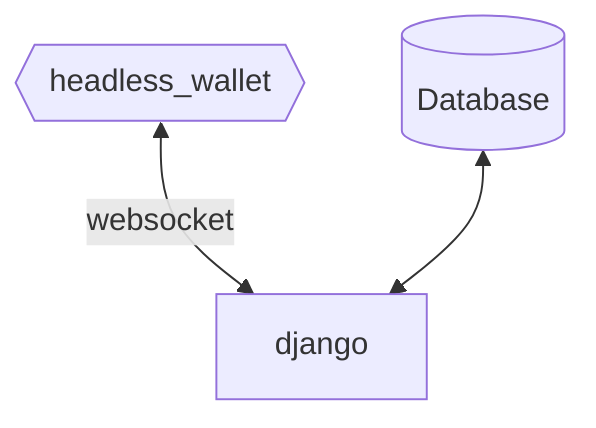

# ICO Platform
We are proud to announce our first open-source project for Hathor ecosystem! 

## What is it!?
Planned to be used as an ICO platform for projects which are willing to sell their tokens with an automatic solution.

The design is as follow



Using the notification plugin bundled on headless wallet, a websocket connection between the wallet and the django backend will be responsible for trigger the TX subsequent treatment.

## Pre-requisites

The only thing you will need before deploy the service is a hathor wallet with an amount of the token will be on sale. Besides that, it's interesting to send all the token amount to only one address, which will be used on RECEIVE_ADDRESS parameter.

## How to deploy

After clone the repo, you will need to configure the parameters of the `docker-compose.template.yml` as follow:

```
db:
    - POSTGRES_DB: db name to be created
    - POSTGRES_USER: db user
    - POSTGRES_PASSWORD: db password

backend:
    - POSTGRES_NAME: the same of above POSTGRES_DB
    - POSTGRES_USER: the same of above POSTGRES_USER
    - POSTGRES_PASSWORD: the same of above POSTGRES_PASSWORD
    - WALLET_PASS_TEST: passphrase to be used on the test wallet
    - WALLET_PASS: passphrase to be used on the main wallet
    - WALLET_ID: id for wallet, integer with maximum 10 digits
    - TOKEN_PRICE: token price in HTR (for example 0.25)
    - TOKEN_BUYBACK_PRICE: token price for the buyback function in HTR (for example 0.20)
    - TOKEN_UUID: uuid of the token will be sold
    - RECEIVE_ADDRESS: address that will be published for people send HTR or token, this address will be scanned for new tx
    - FEES: set true or false for sending a 2% fee for Dozer Team
    - ADMIN_DJANGO_PASSWORD: password for accessing the django admin panel
 wallet:
      - HEADLESS_SEED_DEFAULT: enter your seeds separeted with spaces and without quotes
```

If you want to run at mainnet, comment the wallet service and uncomment the below wallet service, designed for mainnet, remember to change your seeds, if needed.

With the parameters set, `docker-compose.template.yml` can be renamed to `docker-compose.yml` and you can call `docker compose build` and `docker compose up` 

This will build the services and setup the wallets (main and test).